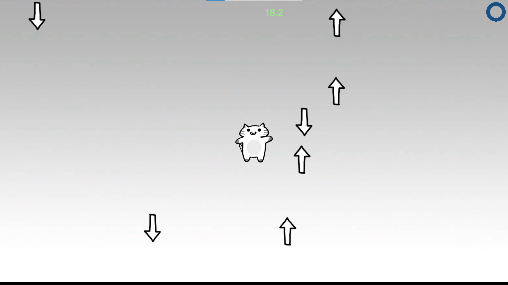

# 弾幕を避けるゲーム

## ゲーム説明
・制限時間が0になるまで、飛んでくる槍や球を避けるゲームです。

・ステージは全部で3つで、全てのステージで制限時間が0になるまで生き残れば、ゲームクリアです。

・5回槍や球に当たるとゲームオーバーになります。

・一定間隔で飛んでくるハートを取得するとダメージ1回分回復します。(HPが満タンの時に取得しても回復しません。)

・画面外に出ることは出来ません。

## 操作説明
・移動：矢印キー

・ゲームオーバーになった場合：画面を左クリックするとステージ1からスタート

・終了：Alt + F4 

## 画面構成

・ 右上の青いゲージ：HP

・真ん中上の緑の数字：ステージの制限時間

・真ん中の猫：プレイヤーキャラクター

## 工夫した所
・3つ目のステージのプレイヤーキャラクターを狙って球が発射される仕組み

・飛んでくる槍や球に当たった時にダメージ音、ハートを取得した時には回復音が鳴るようにした所
